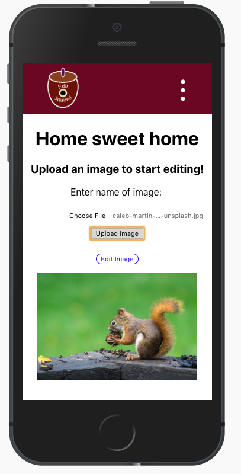

# Edit Squirrel
<p align="center">
  
  <br><br>
  <a href="www.edit-squirrel.com/" font-size="16px" >Live Demo</a>
</p> 

## About
With so many mobile apps that allow image editing, I wanted a site where it's possible to edit images on a laptop without having to download or pay for applications. This website allows users to upload, edit, download, and save images. Users who are registered can save their images to edit as many times as they like.

## Built With
* [React](https://github.com/facebook/create-react-app)
* Express
* Node.js
* PostgreSQL
* [Cloudinary](https://cloudinary.com)
* [Multer](https://github.com/expressjs/multer)
* [React Image Crop](https://github.com/DominicTobias/react-image-crop)


## Working with Cloudinary
The biggest challenge I encountered was integrating Cloudinary.

Cloudinary is a site which enables uploading, storing, manipulating, and delivering images and videos. I chose Cloudinary because it seemed useful for editing and transforming images on live in React, and I thought it would be a nice additional feature that will go with cropping images.

The challenge was that the Cloudinary's image source was only limited to cloudinary image URLs, and the preview image for the image crop was in base64. So with the help of some tutorials and codes, I was able to find a way to convert canvas images to Base64 to image files to URLs. I decided to upload images to Cloudinary to retrieve the image URL every time a user wanted to save the cropped image and edit them further. I have considered updating images in Cloudinary instead of uploading a new file each time, but uploading seemed the more time efficient option.

### Extracting file names from urls
One of the important things to store in the database when using Cloudinary is the public_id. I made a mistake by only storing the image URLs, so I ended up writing a function to extract just the public ID from the url. I used a "folder_name/file_name" format to name my public_id of the images, hence the round about way of getting the folder_name and the file_name. 

If you needed public_ids on the fly, feel free to use this function:

```
let imgUrl = "https://res.cloudinary.com/cloud_name/image/upload/v1546878669/nature/trees.png"

const getPublicId = (url) => {
  let arr = url.split('/');
  let foldername = arr[arr.length - 2];
  let filename = arr[arr.length - 1];

  let public_id_ext = foldername + '/' + filename;
  let public_id = public_id_ext.substring(0, public_id_ext.length - 4);
  return public_id;
}

getPublicId(imgUrl);
// The result is "nature/trees"

```

## Future Additions
 * Be able to update images in place of creating newly edited images
 * Add more edit features
 * Allow users to log in with Google, Facebook, and Twitter
 

## Acknowledgments
I would like to thank [DigitalCrafts](https://www.digitalcrafts.com) for helping me build the skills to create this web app. 
<br>I would also like to thank my instructor [Chris Aquino](https://www.linkedin.com/in/chris-aquino-9a86044/) and teacher's assistant [Aylin DeBruyne](https://github.com/adebruyne) for supporting me (I wouldn't have accomplished this solo project without their help!).

<br>And also to the others who've helped me out with their great coding tutorials:

### Shoaib Bhimani - Setting up Cloudinary in Node
  * [Youtube link](https://www.youtube.com/watch?v=9R4A0-FjG-M&t=227s&list=LLuBSaJZeyAPVxIYzUrBUp1A&index=2)
  (The language is in Hindi but the video was easy to follow along and understand)
  * [GitHub Code](https://github.com/shoaibcode/express-handler/tree/upload-image-part1)
### CodingEntrepreneurs(Justin Mitchel) - Setting up react-image-crop in React
  * [Youtube link](https://www.youtube.com/watch?v=jyeRDo2tP_s&index=28&list=PLEsfXFp6DpzQbwYDx1zgcKJ4tzyWFaESK&t=545s)
  * [GitHub Code](https://github.com/codingforentrepreneurs/Try-Reactjs)
  * [Helper Code](https://www.codingforentrepreneurs.com/blog/a-few-javascript-methods-for-images-files/) -Converting Base64 to canvas and vice versa
### Jason Jarrett - Converting image URL to Base64
  * [Code link](https://staxmanade.com/2017/02/how-to-download-and-convert-an-image-to-base64-data-url/#disqus_thread)
### Gosha Arinich - Creating a mobile responsive layout with React
 * [Code link](https://goshakkk.name/different-mobile-desktop-tablet-layouts-react/)
  
  
